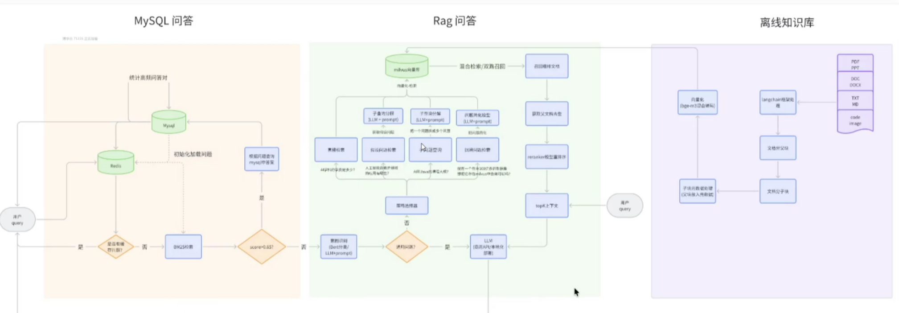
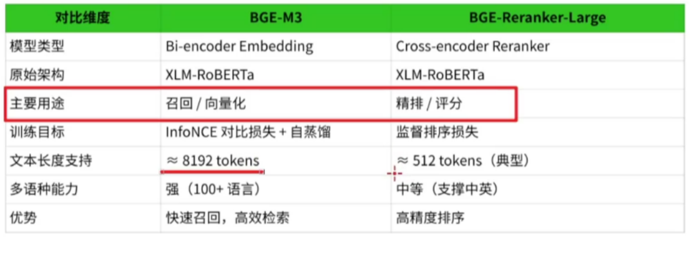
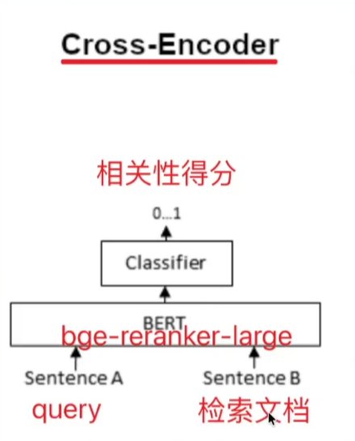
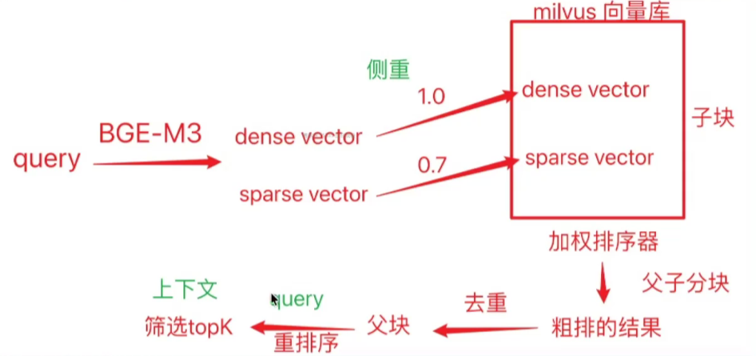
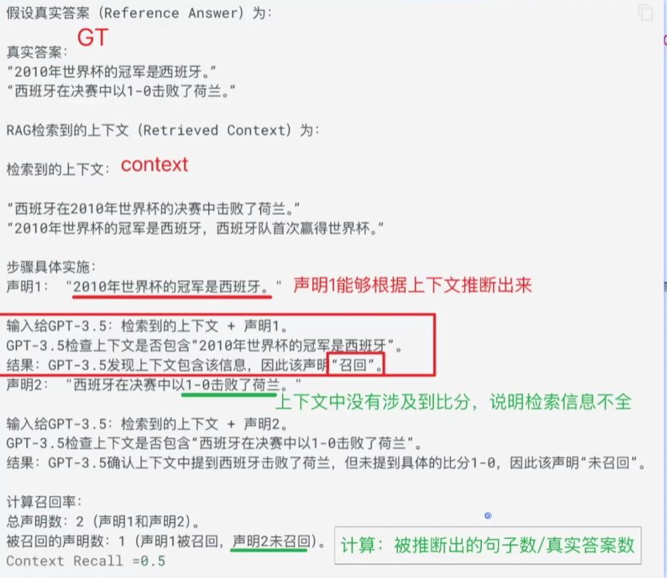
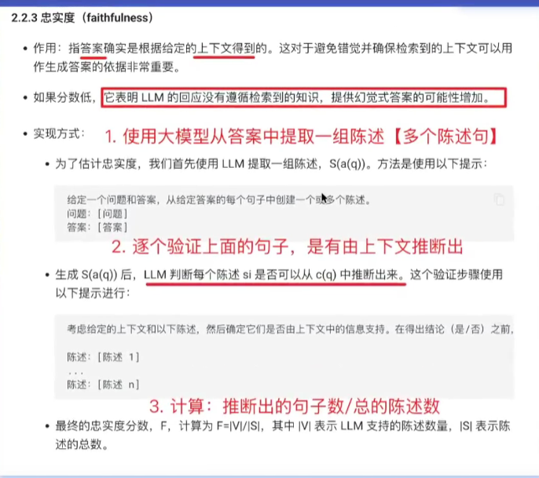
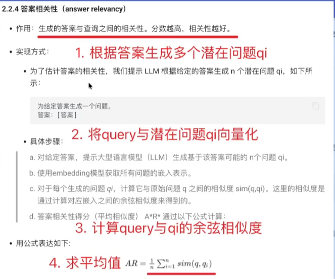

## Milvus向量数据库

结构化数据与非结构化数据

非结构化数据

嵌入向量

做相似度检索， 离不开距离

### Collection 和 Field

IVF_FLAT：是基于倒排索引方法

1. 聚类
2. 倒排索引

IVF_SQ8： 在IVF基础商增加量化

HNSW 图索引

attu

Milvus数据的增删查改

分区检索

过滤检索

范围检索

向量检索

稠密检索

稀疏检索

RRFRanker排序器

加权排序器

总结：
加权排序器：注意不同检索器的度量不同，值域不一致，加权计算的时候可能有问题。需要归一化处理。

需要先删表再删库

## MySQL 问答系统

高频问答数据的缓存

## Python日志记录简介与应用

## BM25算法概述

BM25（BestMatching25）是一种信息检索领域的排名算法，用于计算查询（Query）与文档（Document）之间的相关性得分。它改进了传统的TF-IDF算法，引I入文档长度归一化和词频饱和机制，使检索结果更准确。

BM25原理

衡量一个词的稀有程度

引入长度归一化和词频

##  Redis在RAG中的应用

##  基于MySQL的FQA问答系统实现

jieba分词：文本预处理

0.85 走Mysql  或 Redis 否则走RAG

BM25分词管理

1. 先从redis获取数据
2. redis没有，从mysql中获取
3. 获取问题进行分词，存入redis中

RAG检索增强生成

Bert 二分类

混合检索 = 双路召回

## 文档处理

作用： 离线文档的读取与切块

离线文档存在形式 是以目录方式存在的

基本步骤：
0.预定义多种文档加载器
1.遍历目录，根据文档的扩展名称，选择文档加载器
2.定义文档分割器
包含父子分块的文档分割器
3.遍历每个文档，针对文档进行父子分块
4.返回所有的分块内容

mysqlqa redisqa ragqa

交叉编码BGE-m3 模型 BGE-reranker-large 模型

稠密向量主要是语义编码

稀疏向量主要是关键词编码

知识库的增删改查

需要溯源字段， 需要file_path 文档路径

知识更新，找到知识库删除重新更新

还可以更多溯源字段： 文档页码

侧重稠密向量 使用加权排序器排序， 粗排结果， 解析父文档，父子分块， 可能会出现多个子块对应一个父块，所以需要去重。筛选topK 混合检索与重排序

混合检索逻辑

优化点：

## query改写

1. 结合历史会话改写
2. 关键词扩写
3. 假设问题检索
4. 缩写词改写
5. 一般去噪改写（回溯问题检索）
6. 子查询改写（子查询检索）

提高query质量适合问题检索

直接检索

## RAGAS 评估框架

1. 评估指标是什么？
2. 评估指标怎么算的？

上下文相关性

> 指的是检索到的上下文应该只包含回答问题所需的信息，这个指标旨在惩罚包含冗余信息的情况。

评估俩方面： 上下文对不对， 上下文全部全

上下文召回率

>  衡量检索到的上下文(contexts)与真实答案（ground_truths）的匹配程度。

计算：

被推断出的句子  /  真实答案数

指标怎么算：

忠诚度

答案相关性

作用： 生成答案与查询直接的相关性

 

3-4-5

