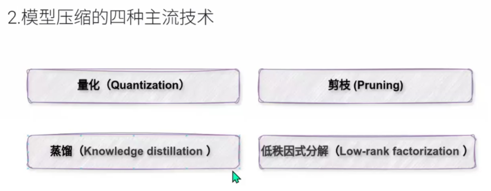
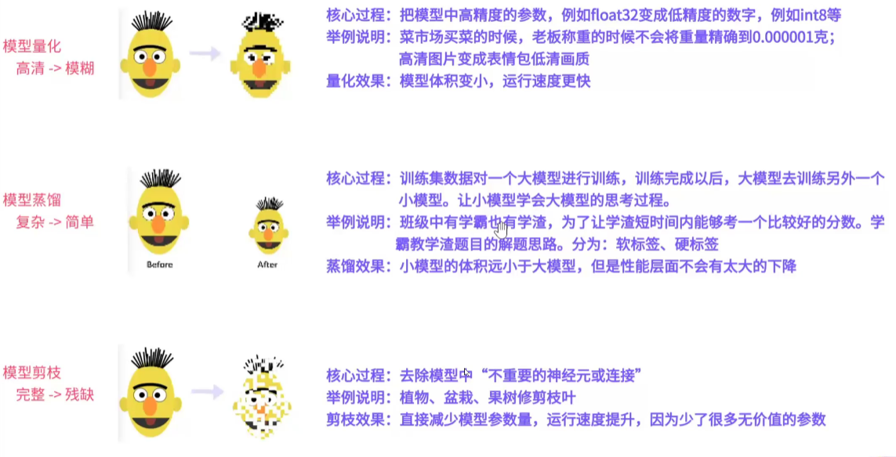
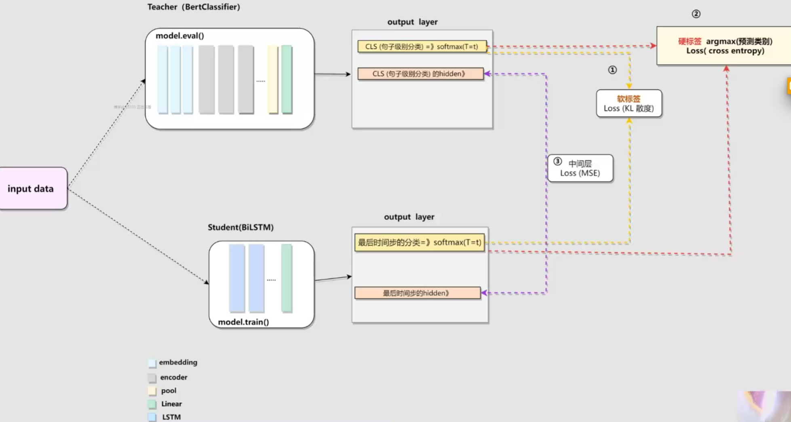
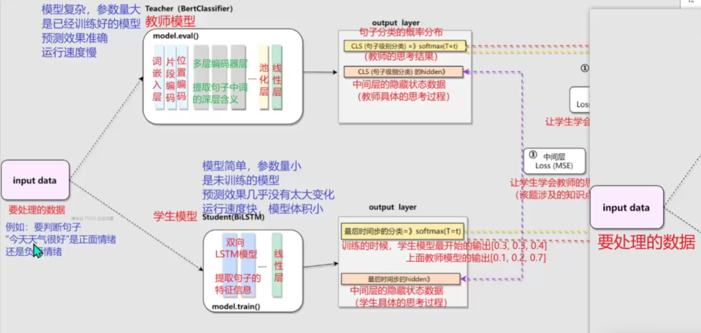
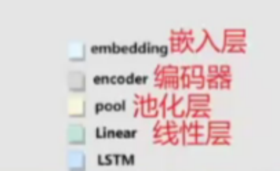

# 模型压缩

四种常见压缩方法

量化，剪支，蒸馏，低秩因式分解

qint8 是什么？

bfloat16 脑浮点数是什么意思？

## 什么是模型的量化

bfloat16 与bfloat16的区别？

训练中量化： 量化感知训练 QAT （A100）

训练后量化： 动态量化DQ（适合中端设备）， 静态量化 PTQ （训练完后直接量化，后续使用过程中不再进行量化）

## 知识蒸馏架构

1. 硬标签蒸馏 交叉熵损失函数
2. 软标签蒸馏：
3. 中间层蒸馏： 

Bert 模式  [读懂BERT，看这一篇就够了 - 知乎](https://zhuanlan.zhihu.com/p/403495863)

双向LSTM [（五）通俗易懂理解——双向LSTM_双向lstm模型-CSDN博客](https://blog.csdn.net/qq_36696494/article/details/89028956)

KL散度  

[深入理解 KL 散度（Kullback-Leibler Divergence）：从直觉、数学到前沿应用的全方位解析 - 知乎](https://zhuanlan.zhihu.com/p/1950257135775642370)

**记住：KL散度就是“我们用一个分布去模仿另一个分布，结果差多少”的一个衡量方式。**

决策树，逻辑回归，机器学习

软标签关键参数：

软标签蒸馏（Knowledge Distillation，知识蒸馏）中的两个关键参数:

- α（权重系数）
- T (温度)

[一文读懂 大模型 温度系数（含全部生成参数） - 知乎](https://zhuanlan.zhihu.com/p/666670367)

α 平衡软硬标签占比的

教师模型：大模型，参数大，预测精准

学生模型： 体积小， 预测相对精准

深度学习： 移动加权平均

> 1. last_hidden_state[:,0]和pooler_output的区别。
>    区别：需要对last_hidden_state[：，0]经过nn.Linear和激活函数处理后，才能得到pooLer_output对应源代码位置：BertModel文件的697行
>
> 2. 为什么使用pooLer_output，而不使用last_hidden_state[：,0]使用pooler_output的原因有如下几个
>    语义对齐：pooler_output已经是句子级别的表示，与下游任务的张量形状是对其的
>    降维简化：从[seq_len,hidden_size】的张量维度，调整形状到 hidden_size 的张量维度
> 3. 获得池化层后的结果有两种方式：
>    3.1- 方式一：推荐。通过实例属性获得bert_output.pooler_output
>    3.2-方式二：通过实例属性索弓得bert_output[1]。1的原因是pooler_output是类中的第2个实例属性
>    对应源代码位置：BertModel文件的1017行

双向LSTM 可以看成俩层LSTM,

词向量掩码

# 剪支

