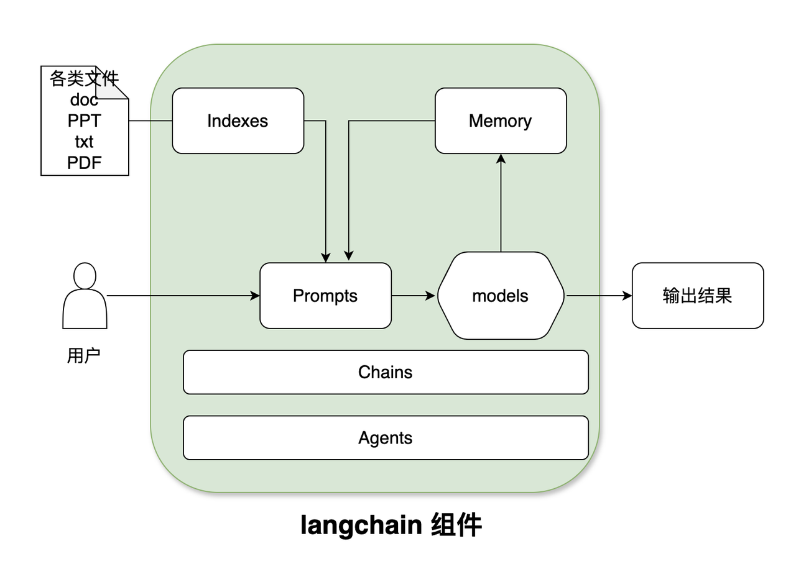
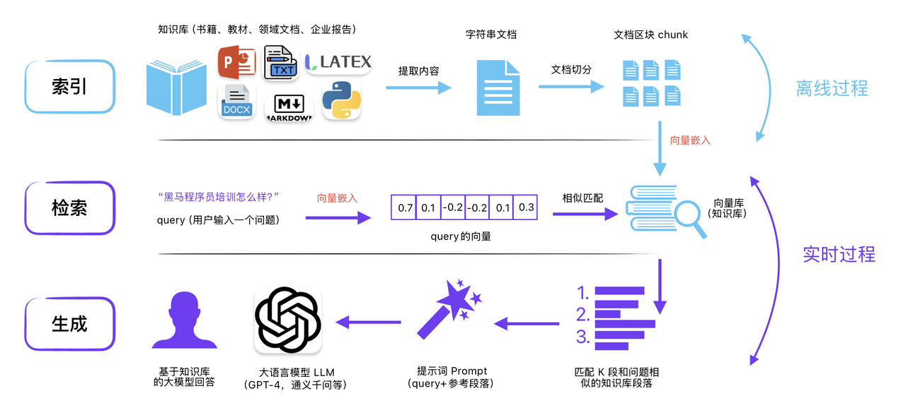
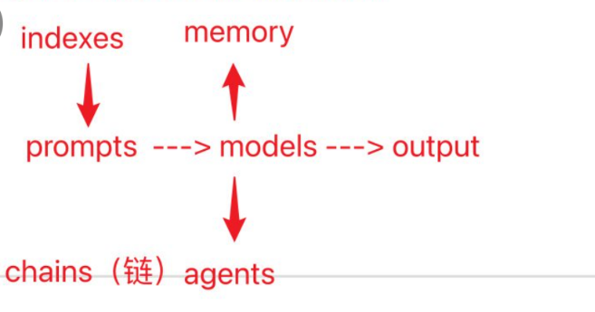

## Langchain

Langchain基础架构




一个LangChain的应用是需要多个组件共同实现的，LangChain主要支持6种组件：

- Models：模型，各种类型的模型和模型集成，比如GPT-4
- Prompts：提示，包括提示管理、提示优化和提示序列化
- Memory：记忆，用来保存和模型交互时的上下文状态
- Indexes：索引，用来结构化文档，以便和模型交互
- Chains：链，一系列对各种组件的调用
- Agents：代理，决定模型采取哪些行动，执行并且观察流程，直到完成为止

## Models 




大模型应用开发包括：

- 大模型应用开发，检索增强（向量库， 提示词， LLM）
- 智能体开发 - (提示词  + LLM +  工具 + 记忆)
- 微调


Langchain做大模型开发




indexes:

1. 文档的读取（加载）
2. 文档切块
3. 向量化， 存储向量库
4. 向量检索


```python
chain  = first_prompt |  llm | second_prompt | llm | StrOutputParser()
```


## zero-shot-prompt


## few-shot-prompt


## Chains (链)


## Agent(代理)

Agent代理，查询中国人口，接入搜索引擎

大模型调用工具是通过Agent调用的，


## 长期记忆

递归分割


