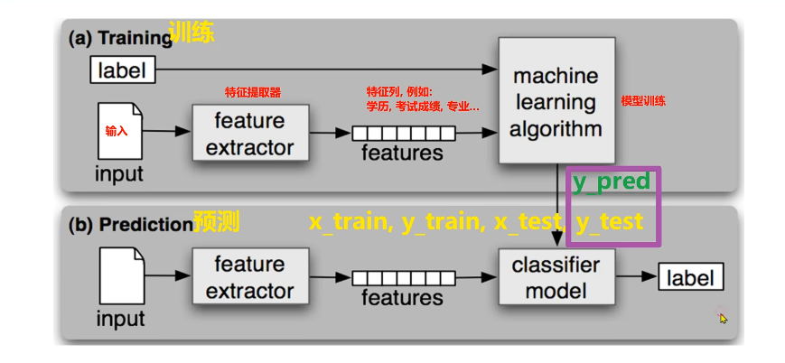

## 有监督，无监督，半监督,强化学习

## 机器学习建模流程

1. 获取数据
2. 数据基本处理
3. 特征工程
4. 机器学习
5. 模型评估

## 有监督学习模型训练和模型预测

## 特征工程概念入门

1. 特征提取
2. 特征预处理: 特征对模型的影响，因量纲问题，有些特征对模型影响大，有些特征影响效 （归一化， 标准化）
3. 特征降维： 将原始数据的维度降低
4. 特征选择： 原始始数据特征很多，但是对模型训练相关是其中一个特征集合子集
5. 特征组合： 把多个的特征合并成一个特征。一般利用乘法或加法来完成

## 拟合

欠拟合， 过拟合， 泛化

泛化： 模型在非训练集上表现好坏的能力

奥卡姆剃刀原则： 给定两个具有相同泛化误差的模型，较简单的模型比较复杂的模型更可取。

## KNN算法简介

K-近邻算法简称KNN， 算法思想为： 如果一个样本在特征空间中的k个最相似的样本中的大多数属于某一个类别，则该样本也属于这个类别

如何确定样本的相似性？

超参

KNN解决的问题有俩种一种是分类一种是回归

## KNN分类与回归流程

分类流程

1.计算未知样本到每一个训练样本的距离
2.将训练样本根据距离大小升序排列
3.取出距离最近的K个训练样本
4.进行多数表决，统计K个样本中哪个类别的样本个数量
5.将未知的样本归属到出现次数最多的类别

回归流程

1.计算未知样本到每一个训练样本的距离
2.将训练样本根据距离大小升序排列
3.取出距离最近的K个训练样本
4.把这个K个样本的目标值计算其平均值
5.将未知的样本预测的值了

## K值的选择

K值过大会发送欠拟合（不容易被异常值影响），过小会发送过拟合

如果K=N

## KNN算法分类API

## KNN算法回归API

## 路径方法

## 特征预处理归一化

 

## 特征预处理标准化

##  交叉验证

交叉验证是一种用于评估机器学习模型性能的统计方法，核心思想是重复地使用数据的不同子集进行训练和验证，从而更稳健地估计模型在未知数据上的表现。

### 什么是交叉验证？

交叉验证是一种数据集的分割方法。其基本操作是将训练集划分为 $n$ 份（也称为“折”或“folds”），然后进行 $n$ 轮训练和验证：

- 每一轮，拿其中 **1 份** 作为 **验证集**（有时也称为测试集）。
- 剩下的 **$n-1$ 份** 作为 **训练集**。
- 最终，模型会在这 $n$ 个不同的验证集上分别得到 $n$ 个性能评分。

### 交叉验证法原理（以 $cv=4$ 为例）

假设我们将数据集划分为 4 份（即 4 折交叉验证），流程如下：

1. **第一次**：把 **第一份** 数据做验证集，其他三份数据做训练集。
2. **第二次**：把 **第二份** 数据做验证集，其他三份数据做训练集。
3. **第三次**：把 **第三份** 数据做验证集，其他三份数据做训练集。
4. **第四次**：把 **第四份** 数据做验证集，其他三份数据做训练集。

**总结**：总共训练 4 次，评估 4 次。

### 如何计算最终得分？

使用训练集 + 验证集多次评估模型后，取这 4 次评估结果的 **平均值** 作为该模型的交叉验证得分。

> **示例计算**：
> 假设 4 次验证的准确率分别为：80%、78%、75%、82%
>
> 交叉验证得分 = $\frac{80\% + 78\% + 75\% + 82\%}{4} = 78.75\%$

### 模型选择与最终评估

交叉验证常用于 **模型选择**（例如选择 KNN 中的 $k$ 值）：

1. **比较不同模型**：例如，分别对 $k=3$、$k=5$、$k=7$ 的 KNN 模型进行 4 折交叉验证，计算各自的平均得分。
2. **选择最优模型**：假设 $k=5$ 的模型平均得分最高。
3. **最终训练**：使用 **全部训练数据**（训练集 + 验证集）对 $k=5$ 的模型重新训练一遍。
4. **最终评估**：使用一个 **独立的测试集**（从未参与过交叉验证的数据）对最终模型进行评估，得到最终的泛化性能。

### 目的

交叉验证法，是划分数据集的一种方法，目的就是为了得到 **更加准确可信的模型评分**，减少因数据划分随机性带来的评估偏差。

## 网格搜索

超参

