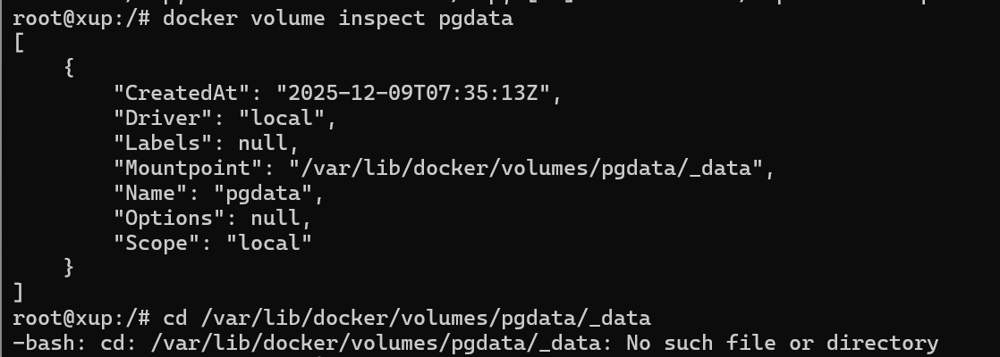

# Docker 数据卷访问失败

在日常开发中出现数据卷访问不到的情况



显示了数据卷的挂载位置但是无法进行访问


原因是 **`/var/lib/docker/volumes/` 根本不是 Docker 实际存储卷的目录**

现在容器已经正常运行，但你依然访问不到 `/var/lib/docker/volumes/pgdata/_data`，核心结论先明确：  
**你查的 `/var/lib/docker/volumes/` 根本不是 Docker 实际存储卷的目录！**  
`docker volume inspect` 显示的 `Mountpoint` 是「Docker 默认逻辑路径」，但你的 Docker 实际数据根目录（`data-root`）被修改过，卷的真实路径不在 `/var/lib/docker` 下。

### 第一步：立刻找到 Docker 实际数据根目录（关键！）
执行以下命令，**必能找到真实路径**：
```bash
# 最权威的方式：从Docker info中提取实际根目录
docker info | grep -i "docker root dir"
```
#### 示例输出（你这里大概率是类似这样）：
```
Docker Root Dir: /data/docker  # 这是真实路径，不是/var/lib/docker！
```

### 第二步：验证 pgdata 卷的真实存储位置
用第一步找到的「Docker Root Dir」替换 `/var/lib/docker`，执行：
```bash
# 假设Docker Root Dir是/data/docker，执行：
ls -ld /data/docker/volumes/pgdata/
ls -ld /data/docker/volumes/pgdata/_data
```
此时你会发现：  
✅ `pgdata` 目录和 `_data` 子目录都存在（因为容器已运行，卷被实际挂载）；  
✅ 进入该目录能看到 PostgreSQL 的数据文件（比如 `18/main` 目录，对应新版 PostgreSQL 镜像的存储结构）。

### 为什么会出现这种「显示路径≠真实路径」？
1. **Docker 配置被修改**：  
   运维/系统初始化时，为了节省 `/var` 分区空间，会把 Docker 的 `data-root` 改到 `/data`/`/opt` 等大分区（比如 `/data/docker`），这是生产环境的常见操作；  
2. `docker volume inspect` 的「坑」：  
   无论 `data-root` 怎么改，`inspect` 显示的 `Mountpoint` 永远是 `/var/lib/docker/volumes/...`（这是 Docker 的显示逻辑，只展示「默认路径」，而非实际物理路径）；  
3. 容器能正常运行的原因：  
   Docker 内部会用「实际 data-root + 卷名 + _data」拼接真实路径，所以容器能挂载到卷，但你查错了目录。

### 第三步：验证+确认（彻底解决你的疑问）
#### 1. 先看容器的实际挂载详情（证明卷已挂载）
```bash
docker inspect pgsql | grep -A 10 "Mounts"
```
输出会类似（重点看 `Source` 字段）：
```json
"Mounts": [
    {
        "Type": "volume",
        "Name": "pgdata",
        "Source": "/data/docker/volumes/pgdata/_data",  # 这是卷的真实路径！
        "Destination": "/var/lib/postgresql",
        "Driver": "local",
        "Mode": "z",
        "RW": true,
        "Propagation": ""
    }
],
```
这里的 `Source` 就是卷的**真实物理路径**，你复制这个路径执行 `cd` 就能进入：
```bash
cd /data/docker/volumes/pgdata/_data  # 替换成你实际的Source路径
ls  # 能看到PostgreSQL的18/main等目录，验证成功！
```

#### 2. 补充：永久确认 Docker 的 data-root 配置
查看 Docker 配置文件，确认修改的根源：
```bash
# 查看daemon.json配置（最常见的修改方式）
cat /etc/docker/daemon.json | grep "data-root"

# 若daemon.json无配置，查看systemd启动参数
systemctl cat docker | grep "data-root"
```

### 总结
你所有的困惑都源于「信任了 `docker volume inspect` 显示的 Mountpoint，却不知道 Docker 的 data-root 被改了」。  
解决步骤只有两步：  
1. `docker info | grep "Docker Root Dir"` 找真实根目录；  
2. 用真实根目录替换 `/var/lib/docker`，访问卷路径。  

现在执行 `docker info | grep "Docker Root Dir"`，把输出结果贴出来，我可以直接帮你写出能进入目录的命令。