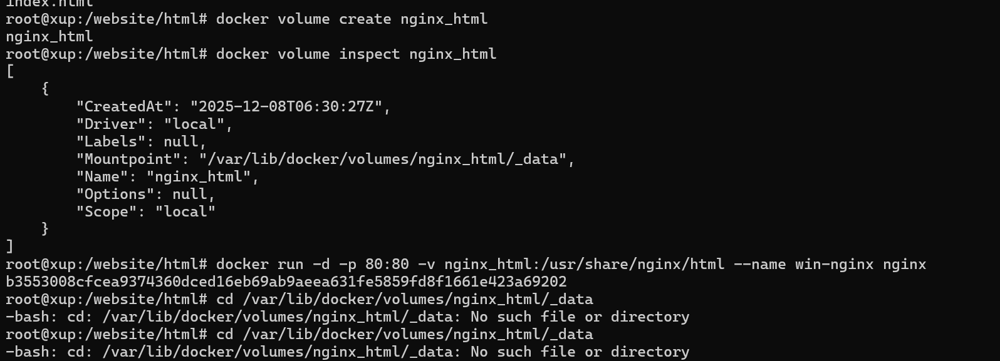
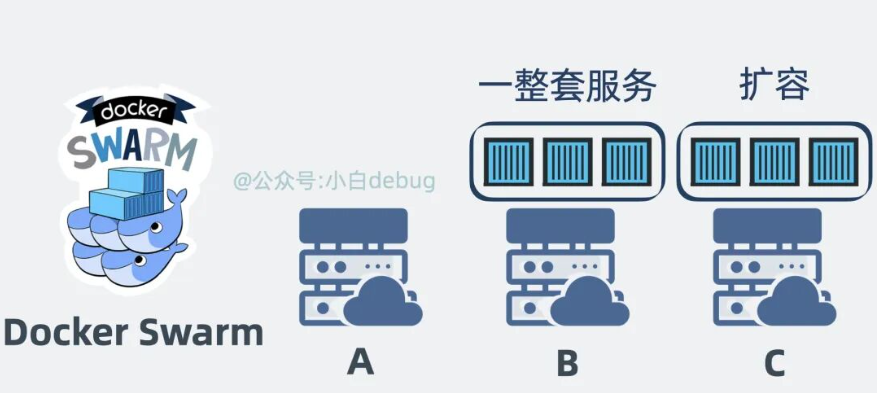

# docker 优质资源整合

<iframe  style="width:100%; aspect-ratio:16/9; margin-top: 2em;"  src="//player.bilibili.com/player.html?bvid=BV1THKyzBER6&autoplay=0&loop=0"  frameborder="0"  allow="accelerometer; autoplay; clipboard-write; encrypted-media; gyroscope; picture-in-picture; web-share"  allowfullscreen> </iframe>


## docker 的安装


Windows中安装docker

个人觉得在windows中使用docker能够像管理应用般管理系统内部的环境不会造成环境冲突等情况，唯一的劣势可能便是需要多环境联动编译的时候使用docker会造成系统储存空间进一减低

根据教程先 `wsl install` Windows中 Linux的环境， 通过此环境编译代码等操作。


参考文档： [【保姆级教程】windows 安装 docker 全流程 - 美码师 - 博客园](https://www.cnblogs.com/littleatp/p/18810739)

## docker常用命令

- docker pull 拉取镜像
- docker images 查看本地镜像
- docker pull --platform=xxxx 镜像名 拉取特定架构镜像
- docker run 运行镜像
- docker volume list 列出所有卷
- docker create 只创建镜像不启动
- docker start 启动容器
- docker exec [容器id] 进入容器内部查看运行情况

- docker run nginx -d -d 代表 分离模式 后台运行不阻塞当前窗口
- -p 表示宿主机的端口与容器内的端口进行绑定
- -a 查看所有容器
- -v 宿主机目录：容器目录
- -e 传递环境变量
- -it 进入容器内部
-  -- rm 当容器停止时删除容器
- -- restart always (unless-stopped) 自动从重启


删除容器


创建数据卷和查看所在数据卷的实际位置


可能出现下面的情况： 数据卷的实际位置无法找到请查看[Docker 数据卷访问失败](./FindVolumes)




删除数据卷的时候需要停止对数据卷的使用


删除掉未使用的数据卷


运行容器


查看容器所有信息命令

```bash
docker inspect 3f41e197b700(容器id))
```


查看进程

```bash
ps -ef
```


绑定挂载与挂载卷挂载


## 挂载卷


## 制作docker容器

```bash
docker build -t wearth_mcp . 
```


## 创建子网

- docker network create network1

同一个子网的容器相互间可以相互通信

docker内部的dns机制可以通过容器名访问容器


### 桥接模式


### host模式


### None模式


## Docker Compose


我们现在知道了 Docker 容器 本身只是**一个**特殊进程，但如果我想要部署**多个**容器，且对这些容器的顺序有一定要求呢？比如一个博客系统，当然是先启动数据库，再启动身份验证服务，最后才能启动博客 web 服务。按理说挨个执行 docker run 命令当然是没问题的，但有没有更优雅的解决方案？有。我们可以通过一个 **YAML** 文件写清楚要部署的**容器有哪些**，**部署顺序**是怎么样的，以及这些容器占用的 **cpu 和内存**等信息。通过这个文件启动定义的所有容器

- docker compose up -d

```dockerfile
version: "3.8"

services:
  A:
    image: "some-image-for-a"
    deploy:
      resources:
        limits:
          cpus: "0.50" # 限制 CPU 使用率为 50%
          memory: 256M # 限制内存使用量为 256MB

  B:
    image: "some-image-for-b"
    depends_on:
      - A

  C:
    image: "some-image-for-c"
    depends_on:
      - B
```

然后，通过一行`Docker-compose up`命令，开始解析 YAML 文件，将容器们一键按顺序部署，就完成**一整套服务**的部署。这其实就是 **Docker Compose** 干的事情


## docker Swarm

Docker 解决的是**一个容器**的部署。Docker Compose 解决的是**多个容器组成的一整套服务**的部署。那 Docker Swarm 就更高维度了，它解决的其实是这一整套服务**在多台服务器上的集群部署**问题。比如在 A 服务器坏了，就将服务在 B 服务器上重新部署一套，实现迁移，还能根据需要对服务做扩缩容。





## Docker 与 Kubernetes(k8s) 的关系

<iframe  style="width:100%; aspect-ratio:16/9; margin-top: 2em;"  src="//player.bilibili.com/player.html?bvid=BV1aA4m1w7Ew&autoplay=0&loop=0"  frameborder="0"  allow="accelerometer; autoplay; clipboard-write; encrypted-media; gyroscope; picture-in-picture; web-share"  allowfullscreen> </iframe>

本文一下内容主要解决下面的问题

```
docker是什么？
docker架构原理？
docker的命令基础
docker容器和虚拟机有什么区别？
docker compose是什么？
docker swarm是什么？
docker compose和docker swarm的区别是什么？
docker和kubernetes(k8s)的关系是什么？
docker swarm和kubernetes(k8s)的差异是什么？
```

k8s 会在多台 Node 服务器上调度 Pod，进行部署和扩缩容。


每个 Pod 内部可以含有多个 container，每个 container 本质上就是一个服务进程。

是不是感觉**k8s**跟 **Docker Swarm** 做的事情很像？没错，其实 Docker Swarm 是 k8s 的**竞品**，既然是竞品，那它们做的事情其实区别就不大了。现在回过头来看 Docker 容器和 k8s 之间的关系，思路就清晰了。Docker 部署的**容器**，其实就是 k8s 调度的 Pod 里的 **container**，它们都叫**容器**，其实是一回事。只不过 k8s 除了支持 Docker 的容器外，还支持别人家的容器。Docker Compose 基于多个 container 创建的**一整套服务**，其实就是 k8s 里的 **pod**。而 Docker Swarm 做的事情和 k8s 一样，本质上就是在调度 pod。回过头来看下 k8s 的官方定义，叫容器编排引擎，将它理解为，以 API **编**程的方式管理安**排**各个容器的引擎，是不是就特别精辟。


## docker的架构原理

docker是经典的Cline/Serve 架构

Client 对应 Docker-cli， Server 对应 Docker daemon。我们在命令行里敲 Docker 命令，使用的就是 Docker-cli.


Docker-cli 会解析我们输入的 cmd 命令，然后调用 Docker daemon 守护进程提供的 RESTful API，守护进程收到命令后，会根据指令创建和管理各个容器。再具体点，Docker Daemon 内部分为 Docker Server、Engine 两层。`Docker Server 本质上就是个 HTTP 服务，负责对外提供操作容器和镜像的 api 接口，接收到 API 请求后，会分发任务给 Engine 层，Engine 层负责创建 Job，由 Job 实际执行各种工作。`


## 总结

- • Docker 本质上就是一个将**程序和环境打包并运行**的工具软件，而 Docker 容器本质上只是个自带独立运行环境的**特殊进程**，底层用的其实是**宿主机的操作系统内核**。
- • Docker 软件 通过 Dockerfile 描述环境和应用程序的依赖关系， docker build 构建镜像， docker pull/push 跟 Docker Registry 交互实现存储和分发镜像，docker run 命令基于镜像启动容器，基于容器技术运行程序和它对应的环境，从而解决环境依赖导致的各种问题。
- • Docker 解决的是**一个容器**的部署问题，Docker Compose 解决的是**多个容器组成的一套服务**的部署问题，Docker Swarm 解决的是多个容器组成的**一套服务在多台服务器上的部署问题**，k8s 则是 Docker Swarm 的竞品，在更高维度上**兼容**了 Docker 容器，实现了容器编排调度。


参考文章： [Docker 是什么？ 和 k8s 之间是什么关系？](https://mp.weixin.qq.com/s/_ldWjMNgyAsglGexSbsqEw)

[一文彻底搞懂大模型 - RAG（检索、增强、生成）-CSDN博客](https://blog.csdn.net/a2875254060/article/details/142468037)
