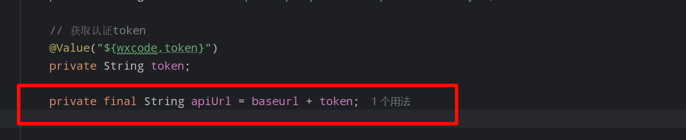

## 问题分析

思考： 详看代码检查问题




分析： 类加载过程中会进行类的初始化，初始化的过程中一般是静态的而数据的注入是数据类型初始化后，所以上面的apiUrl在最后是为空的情况


**解决方案**


## 1. 問題現象 (Problem Description)

在 Spring Boot 項目集成 Nacos 配置中心時，出現以下異常情況：

- **成功**：`server.port` 等基礎配置可以正常讀取並動態更新。

- **失敗**：自定義業務配置 `wxcode.token` 獲取為 `null` 或拼接結果異常（如 `nullnull`）。

- 代碼結構

  ：

  ```java
  @Value("${wxcode.baseurl}")
  private String baseurl;
  
  @Value("${wxcode.token}")
  private String token;
  
  // 現象：此處拼接結果為 "nullnull"
  private final String apiUrl = baseurl + token; 
  ```

------

## 2. 深度剖析 (Root Cause Analysis)

## A. Java 類加載與 Spring 注入順序 (核心原因)

這是初學者最容易踩的坑。Spring 的注入流程如下：

1. **實例化 (Instantiation)**：Spring 先執行 `new YourClass()`。此時所有成員變量（如 `apiUrl`）會按照定義順序進行初始化賦值。
2. **屬性賦值 (Population)**：在實例化完成後，Spring 才會解析 `@Value` 並將 Nacos 中的值注入到 `baseurl` 和 `token` 中。
3. **結論**：當 `apiUrl` 執行拼接時，`baseurl` 尚未被注入，因此結果必然是 `null + null`。

## B. YAML 語法特殊字符干擾

在之前的配置中發現了 **全形引號 (`”`)**：

- `token: "xxx”`
- YAML 解析器無法識別非標準引號，這會導致該節點解析失敗，或是獲取到的字符串包含了不可見的特殊字符，導致 API 調用報 401 錯誤。

------

## 3. 解決方案 (Solutions)

## 方案一：直接在 `@Value` 中拼接 (最推薦)

利用 Spring EL 表達式直接完成拼接，語法簡潔且由 Spring 統一管理初始化。

```java
@Value("${wxcode.baseurl}${wxcode.token}")
private String apiUrl;
```

## 方案二：使用 `@PostConstruct` 緩衝

在所有依賴注入完成後，再執行拼接邏輯。

```java
private String apiUrl;

@PostConstruct
public void init() {
    // 此時 baseurl 和 token 已由 Spring 注入完畢
    this.apiUrl = this.baseurl + this.token;
}
```

## 方案三：動態方法獲取 (防失效)

如果 Nacos 開啟了動態刷新 (`@RefreshScope`)，使用方法獲取能確保每次拿到的都是最新值。

```java
public String getApiUrl() {
    return this.baseurl + this.token;
}
```

------

## 4. 排查清單 (Checklist)

1. **檢查引號**：確保 YAML 中所有引號均為半形（`"`），或者乾脆不加引號。
2. **檢查縮排**：確認 `wxcode` 層級與 `server` 對齊，沒有多餘空格。
3. **動態更新**：如果需要 Nacos 修改後立即生效，類上必須添加 `@RefreshScope` 註解。
4. **日誌確認**：若依然失敗，啟動時觀察日誌是否有 `Could not resolve placeholder` 報錯

