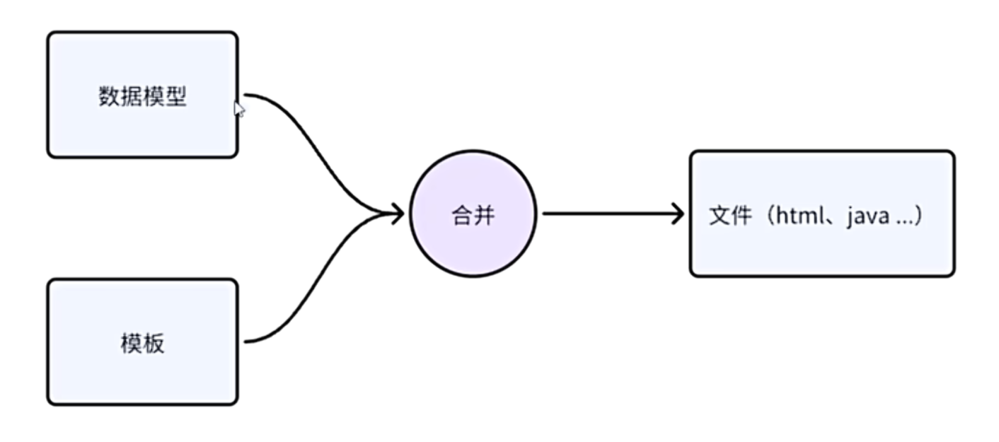

## 介绍Velocity 

官网： [The Apache Velocity Project](https://velocity.apache.org/)




**Apache Velocity** 是一个基于 Java 的开源模板引擎，由 Apache 软件基金会维护。它的核心理念是**将业务逻辑（Java 代码）与表现层（页面设计）分离**，遵循 MVC（模型 - 视图 - 控制器）设计模式中的“关注点分离”原则。


### 1. 核心概念

Velocity 的工作流程主要涉及三个核心组件：

- **模板 (Template)**：包含静态内容（如 HTML、XML、SQL 或纯文本）和动态指令（VTL 脚本）。模板文件通常以 `.vm` 为后缀。
- **上下文 (Context)**：一个数据容器（通常是 `VelocityContext` 对象），用于在 Java 应用程序和模板之间传递数据。开发者将业务数据放入 Context，模板从中读取并渲染。
- **引擎 (VelocityEngine)**：负责加载模板、合并上下文数据并生成最终输出的核心组件。

### 2. Velocity 模板语言 (VTL)

Velocity 使用一种简单而强大的脚本语言，称为 **VTL (Velocity Template Language)**。它的设计目标是让网页设计师即使不懂 Java 编程，也能理解并修改动态页面。

**主要语法特性：**

- **变量引用**：使用 `$` 或 `#` 符号。例如 `$variable` 或 `${variable}`。

- **注释**:

  - 单行：`## 这是一个注释`
  - 多行：`#* 这是一个多行注释 *#`

- **条件判断**:

  ```velocity
  #if ($condition)
      条件成立时显示的内容
  #else
      条件不成立时显示的内容
  #end
  ```

- **循环语句**:

  ```velocity
  #foreach ($item in $list)
      序号[$foreach.index] 当前项：$item
  #end
  ```

- **宏定义 (Macro)**:类似于函数，允许定义可重用的代码块。

  ```velocity
  #macro (myMacro $arg)
      这里是宏的内容：$arg
  #end
  ```


### 3. 简单示例

假设有一个 Java 应用传入一个用户列表 `users` 到 Context 中，模板 `user_list.vm` 可能如下：

```velocity
<html>
<body>
  <h1>用户列表</h1>
  <ul>
    #foreach ($user in $users)
      <li>$user.name - $user.email</li>
    #end
  </ul>
</body>
</html>
```

Velocity 会遍历 `$users` 集合，将每个用户的姓名和邮箱填充到 `<li>` 标签中，最终输出完整的 HTML 页面。

总的来说，Velocity 是一个经典且实用的 Java 模板引擎，特别适合需要快速生成文本内容且希望保持代码与视图清晰分离的项目。
