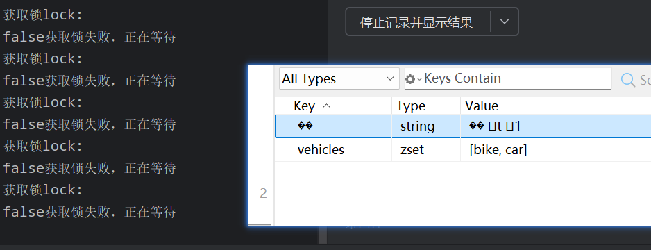

---
title:伪锁竞争问题
tags: [Java， 锁竞争]
categories: [多线程]
date: 2026-4-6
description: 伪锁竞争问题
articleGPT: 伪锁竞争问题
references:
  - title: Java
    url: https://github.com/imsyy/vitepress-theme-curve
---





从你提供的截图来看：

- 左侧日志反复打印：  
  `获取锁lock:`  
  `false获取锁失败，正在等待`  
  → 表明**应用层在尝试获取某个锁，但一直失败**

- 右侧 Redis 数据显示：
  - 一个 key 名为 ``（乱码），类型是 `string`，值为 ` Qt 01`（也是乱码）
  - 另一个 key 是 `vehicles`，类型为 `zset`，值为 `[bike, car]`

---

## 🔍 核心问题分析

### ✅ **这不是 Redis 本身的问题，而是客户端代码/序列化配置错误导致的“伪锁竞争”**

具体原因如下：

---

### 🚨 原因一：**Redis Key 名称被错误序列化 → 产生乱码 key**

你看到的 `` 和 ` Qt 01` 极大概率是 **Java 对象（如 String、byte[]）被错误地用非 UTF-8 编码序列化后写入 Redis** 所致。

#### 典型场景：
```java
// 错误示例：直接把字节数组当字符串 key 使用
byte[] keyBytes = "mylock".getBytes(StandardCharsets.UTF_16); // 用了 UTF-16
String key = new String(keyBytes); // 转成 String → 乱码
redis.set(key, "1"); // 写入 Redis → key 显示为 
```

或：

```java
// 使用了自定义序列化器（如 Protobuf/Kryo），但未正确配置
RedisTemplate<String, String> template = new RedisTemplate<>();
template.setKeySerializer(new GenericJackson2JsonRedisSerializer()); // ❌ 错误：用于 key 序列化
template.setValueSerializer(new GenericJackson2JsonRedisSerializer());
```

> ⚠️ **关键点**：Redis 的 key 必须是 **UTF-8 编码的字符串**。如果用 `byte[]` 或非 UTF-8 编码生成 key，Redis 客户端（如 Redis Desktop Manager、RedisInsight）会显示为乱码（如 ``）。

---

### 🚨 原因二：**锁逻辑依赖这个乱码 key，但多个线程/实例都在争抢同一个“错误 key”**

比如你的锁实现可能是：

```java
public boolean tryLock(String lockName) {
    String key = "lock:" + lockName; // lockName 是乱码字节转的 String
    return redis.set(key, "1", SetOption.ifAbsent(), SetOption.expiry(10, TimeUnit.SECONDS));
}
```

如果 `lockName` 本身是乱码（如 `""`），那么所有线程都试图去 set 同一个乱码 key —— 看似“竞争”，实则是**因为 key 生成错误，导致锁逻辑失效或异常**。

而日志中反复打印 `false获取锁失败，正在等待`，说明：
- `set nx ex` 操作返回 `false`（已有值）
- 但那个“已有值”很可能就是上一次因乱码写入的无效数据（如 ` Qt 01`）

→ **本质是：锁 key 被污染了，不是真正的并发竞争，而是数据错乱导致的假性失败**。

---

### 🚨 原因三：**可能混用了不同序列化方式的 RedisTemplate**

常见错误配置：

```java
// 配置1：用于缓存（value 是 JSON）
RedisTemplate<String, Object> cacheTemplate;

// 配置2：用于分布式锁（key/value 都应是 String）
RedisTemplate<String, String> lockTemplate;

// 但实际代码中：
redisTemplate.opsForValue().set("lock:order", "1"); // 用的是 cacheTemplate！
// → key 被序列化为 byte[]，value 被 JSON 序列化 → 存入 Redis 的是二进制乱码
```

结果：
- Redis 中看到的 key 是乱码（如 ``）
- value 是 JSON 字符串（如 `"\"1\""` 或 ` Qt 01`）
- 多个线程读取时，解析失败 → 认为“锁未释放” → 无限重试等待

---

## 🔧 如何验证与修复？

### ✅ 步骤 1：检查锁 key 的生成逻辑

搜索代码中类似：
```java
String lockKey = "lock:" + someObject;
// 或
String lockKey = someObject.toString(); // 如果 someObject 是 byte[] 或非 UTF-8 字符串
```

确保 `lockKey` 是 **纯 UTF-8 字符串**，例如：
```java
String lockKey = "lock:" + URLEncoder.encode(resourceName, StandardCharsets.UTF_8);
// 或直接使用安全字符
String lockKey = "lock:" + resourceName.replaceAll("[^a-zA-Z0-9_\\-]", "_");
```

### ✅ 步骤 2：检查 RedisTemplate 配置

```java
@Bean
public RedisTemplate<String, String> redisTemplate(RedisConnectionFactory factory) {
    RedisTemplate<String, String> template = new RedisTemplate<>();
    template.setConnectionFactory(factory);
    
    // ✅ 正确：key 和 value 都用 String 序列化器（适用于锁、简单字符串）
    template.setKeySerializer(new StringRedisSerializer());
    template.setValueSerializer(new StringRedisSerializer());
    template.setHashKeySerializer(new StringRedisSerializer());
    template.setHashValueSerializer(new StringRedisSerializer());
    
    template.afterPropertiesSet();
    return template;
}
```

> ❌ 禁止对 **锁的 key/value** 使用 `GenericJackson2JsonRedisSerializer`、`JdkSerializationRedisSerializer` 等。

### ✅ 步骤 3：清理 Redis 中的乱码 key

```bash
# 在 redis-cli 中
KEYS "lock:*"      # 查看所有锁 key
DEL ""            # 删除乱码 key（注意：需用引号包裹）
```

或用 RedisInsight：选中乱码 key → Delete。

---

## 📌 总结：为什么会出现“反复获取锁失败”？

| 原因                     | 说明                                                         |
| ------------------------ | ------------------------------------------------------------ |
| 🔴 **Key 序列化错误**     | Java 对象被错误转为字符串（如 UTF-16 → String），导致 Redis 中 key 乱码 |
| 🔴 **序列化器配置不当**   | 用 JSON 序列化器处理锁的 key/value，写入二进制数据           |
| 🔴 **锁逻辑依赖错误 key** | 多个线程争抢同一个乱码 key，但该 key 的值是无效数据，导致 `set nx` 总失败 |
| 🟡 **不是真实高并发竞争** | 实际是数据污染导致的“假死锁”，而非性能瓶颈                   |

---

## 💡 附加提醒

- `vehicles` 是正常的 zset，说明其他业务功能正常 → **问题仅限于锁相关逻辑**
- 日志中 `false获取锁失败，正在等待` 是应用层自己打印的，说明你用了类似 `while(!tryLock()) { Thread.sleep(100); }` 的轮询逻辑 → 一旦锁 key 异常，就会无限循环卡住
- **和多会话发 rz/sz 无关**，这是完全独立的问题（你前面提到的 rz/sz 是终端协议问题，这里是 Redis 数据层面问题）

---

✅ **一句话结论**：  
> **乱码 key 是因序列化错误导致的，锁失败是因应用试图操作一个被污染的 key；修复关键是统一使用 `StringRedisSerializer` 并确保 lock key 为合法 UTF-8 字符串。**