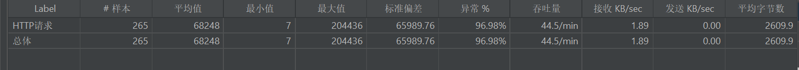
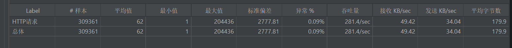

# 📝 Nacos 线程分析与 Redis 连接泄漏问题排查笔记

---

## 一、问题现象

### 1.1 线程状态分析

**现象**：系统中存在多个 Nacos 客户端线程处于 `WAITING` 状态

```
ID = 36: 'com.alibaba.nacos.client.login-executor.0'
ID = 37: 'com.alibaba.nacos.client.listen-executor.0'
ID = 175: 'nacos-grpc-client-executor-127.0.0.1-25'
```

**结论**：✅ **正常现象**，这些是 Nacos 客户端的后台工作线程，处于待命状态，不是卡死。

---

### 1.2 压测异常

**现象**：使用 JMeter 压测时出现大量异常



```
java.net.SocketException: Socket closed
```

**JMeter 聚合报告**：
- 异常率：96.90%
- 平均响应时间：68164 毫秒（约 68 秒）
- 最大响应时间：204436 毫秒（约 204 秒）

**结论**：服务端处理速度过慢，JMeter 等不及主动断开连接。

---

## 二、代码问题分析

### 2.1 问题代码

```java
@GetMapping ("/redis")
public String redis() throws InterruptedException {
    Jedis jedis = jedisPool.getResource();  // ⚠️ 获取连接
    
    val mykey = jedis.get("mykey");
    if (mykey == null) {
        return SeachSQL();  // ⚠️ 直接 return，连接未关闭！
    }
    
    return Objects.requireNonNull(jedis.get("mykey")).toString();  // ⚠️ 连接未关闭！
}

private String SeachSQL() throws InterruptedException {
    synchronized (this) {  // ⚠️ 锁住整个 Controller 实例
        Jedis jedis = jedisPool.getResource();
        // ...
    }
}
```

---

### 2.2 三大致命问题

| 问题             | 后果                     | 严重程度 |
| ---------------- | ------------------------ | -------- |
| **连接泄漏**     | 连接池耗尽，后续请求阻塞 | 🔴 极严重 |
| **串行化锁**     | 所有请求排队执行         | 🔴 极严重 |
| **重复获取连接** | 资源浪费，加剧泄漏       | 🟡 严重   |

---

## 三、修复方案

### 3.1 修复后的代码

```java
@GetMapping ("/redis")
public String redis() {
    try (Jedis jedis = jedisPool.getResource()) {  // ✅ 自动关闭连接
        val mykey = jedis.get("mykey");
        if (mykey == null) {
            return SeachSQL();
        }
        System.out.println("缓存命中, 直接返回");
        return Objects.requireNonNull(mykey).toString();
    }
}

private String SeachSQL() {
    System.out.println("缓存未命中, 查询数据库");
    
    try (Jedis jedis = jedisPool.getResource()) {  // ✅ 自动关闭连接
        val value1 = jedis.get("mykey");
        if (value1 != null) {
            return value1;
        }
        
        jedis.set("mykey", "Hello from Jedis");
        String value = jedis.get("mykey");
        System.out.println(value);
        
        jedis.zadd("vehicles", 0, "car");
        jedis.zadd("vehicles", 0, "bike");
        
        val vehicles = jedis.zrange("vehicles", 0, -1);
        System.out.println(vehicles);
        
        return value;  // ✅ 直接返回，不需要再查
    }
}
```

---

## 四、核心知识点总结

### 4.1 Redis 连接管理

#### ❌ 错误写法

```java
Jedis jedis = jedisPool.getResource();
// ... 操作 ...
// 忘记关闭连接
```

#### ✅ 正确写法

```java
// 方式一：try-with-resources（推荐）
try (Jedis jedis = jedisPool.getResource()) {
    // ... 操作 ...
}  // 自动调用 jedis.close()

// 方式二：手动关闭
Jedis jedis = null;
try {
    jedis = jedisPool.getResource();
    // ... 操作 ...
} finally {
    if (jedis != null) {
        jedis.close();
    }
}
```

---

### 4.2 连接池配置最佳实践

```java
JedisPoolConfig poolConfig = new JedisPoolConfig();

// 连接池大小
poolConfig.setMaxTotal(50);      // 最大连接数
poolConfig.setMaxIdle(10);       // 最大空闲连接
poolConfig.setMinIdle(5);        // 最小空闲连接

// 连接超时
poolConfig.setMaxWaitMillis(3000);  // 获取连接最大等待时间 3 秒
poolConfig.setTestOnBorrow(true);   // 借出时检查连接有效性

// 创建连接池
JedisPool jedisPool = new JedisPool(poolConfig, "localhost", 6379);
```

---

### 4.3 synchronized 锁的使用

#### ❌ 错误用法

```java
synchronized (this) {  // 锁住整个对象实例
    // ... 重操作 ...
}
```

**问题**：
- 锁范围过大，影响并发性能
- 所有请求串行执行

#### ✅ 正确用法

```java
// 方案一：使用细粒度锁
private final Object lock = new Object();

synchronized (lock) {
    // ... 仅保护关键代码 ...
}

// 方案二：使用分布式锁（防止缓存击穿）
String lockKey = "lock:mykey";
if (redisTemplate.opsForValue().setIfAbsent(lockKey, "1", 10, TimeUnit.SECONDS)) {
    try {
        // ... 查询数据库并写入缓存 ...
    } finally {
        redisTemplate.delete(lockKey);
    }
}
```


最终效果



---

### 4.4 Spring Boot 中的 Redis 使用

#### 推荐使用 RedisTemplate

```java
@Autowired
private RedisTemplate<String, String> redisTemplate;

@GetMapping("/redis")
public String redis() {
    // 自动管理连接，无需手动关闭
    String value = redisTemplate.opsForValue().get("mykey");
    if (value == null) {
        // 缓存未命中，查询数据库
        value = queryDatabase();
        redisTemplate.opsForValue().set("mykey", value);
    }
    return value;
}
```

**优点**：
- ✅ 自动连接管理
- ✅ 支持序列化
- ✅ 与 Spring 生态无缝集成

---

### 4.5 缓存穿透、击穿、雪崩

| 问题         | 定义                                    | 解决方案               |
| ------------ | --------------------------------------- | ---------------------- |
| **缓存穿透** | 查询不存在的数据，每次都穿透到数据库    | 布隆过滤器、空值缓存   |
| **缓存击穿** | 热点 key 过期瞬间，大量请求穿透到数据库 | 分布式锁、永不过期     |
| **缓存雪崩** | 大量 key 同时过期，数据库压力骤增       | 随机过期时间、集群部署 |

---

### 4.6 JMeter 压测配置

#### 调整超时时间

```
HTTP 请求 -> 高级 -> 响应超时：300000（5分钟）
```

#### 避免端口耗尽（Windows）

```reg
HKEY_LOCAL_MACHINE\SYSTEM\CurrentControlSet\Services\Tcpip\Parameters

MaxUserPort = 65534 (DWORD)
TcpTimedWaitDelay = 30 (DWORD)
```

---

## 五、问题排查流程图

```
服务响应慢
    ↓
检查线程状态
    ↓
├─ WAITING 状态？ → 可能是正常待命（如 Nacos 线程）
└─ RUNNABLE 状态？ → 可能是死循环或阻塞
    ↓
检查连接池
    ↓
├─ 连接泄漏？ → 修复 try-with-resources
└─ 连接不足？ → 增大连接池配置
    ↓
检查锁机制
    ↓
├─ synchronized 范围过大？ → 缩小锁范围
└─ 串行化严重？ → 改用分布式锁
    ↓
检查 Redis 配置
    ↓
├─ 连接超时？ → 增加超时时间
└─ 网络延迟？ → 优化网络或使用本地缓存
```

---

## 六、最佳实践清单

### ✅ 代码层面

- [ ] 使用 `try-with-resources` 管理 Redis 连接
- [ ] 避免在 Controller 层使用 `synchronized (this)`
- [ ] 统一 Redis 客户端（不要混用 Jedis 和 RedisTemplate）
- [ ] 实现双重检查锁防止缓存击穿
- [ ] 添加连接池配置和超时设置

### ✅ 配置层面

- [ ] 设置合理的连接池大小（MaxTotal、MaxIdle）
- [ ] 配置连接超时时间（MaxWaitMillis）
- [ ] 启用连接有效性检查（TestOnBorrow）
- [ ] 为热点数据设置合理的过期时间
- [ ] 配置 JMeter 超时时间以适应慢接口

### ✅ 监控层面

- [ ] 监控连接池使用率
- [ ] 监控 Redis 命中率
- [ ] 监控接口响应时间
- [ ] 监控线程状态和数量
- [ ] 监控 GC 情况

---

## 七、常见错误代码对比

| 场景         | 错误写法                                 | 正确写法                                      |
| ------------ | ---------------------------------------- | --------------------------------------------- |
| **获取连接** | `Jedis jedis = jedisPool.getResource();` | `try (Jedis jedis = jedisPool.getResource())` |
| **锁范围**   | `synchronized (this)`                    | `synchronized (lock)` 或 Redis 锁             |
| **返回值**   | 写入后再次查询                           | 直接返回刚写入的值                            |
| **异常处理** | 忽略异常                                 | 捕获并记录日志                                |

---

## 八、总结

### 核心问题

1. **连接泄漏** → 连接池耗尽 → 服务阻塞
2. **串行化锁** → 并发性能差 → 响应时间长
3. **混用客户端** → 数据不一致 → 缓存失效

### 解决方案

1. 使用 `try-with-resources` 确保连接关闭
2. 移除 `synchronized (this)`，改用分布式锁
3. 统一使用 `RedisTemplate` 管理 Redis 操作

### 经验教训

- 🔑 **连接必须关闭**：每次 `getResource()` 都必须有对应的 `close()`
- 🔑 **锁要细粒度**：不要锁住整个对象，只锁关键代码
- 🔑 **统一客户端**：不要混用不同的 Redis 客户端
- 🔑 **监控很重要**：及时发现连接池、响应时间等异常

---

**笔记整理时间**：2026-04-13  
**适用场景**：Spring Boot + Redis + JMeter 压测  
**关键词**：Redis 连接泄漏、synchronized 锁、缓存击穿、JMeter 压测