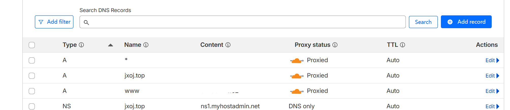

# 关于Niginx中反向代理存在的问题

在使用Nginx反向代理时经常出现这样的问题 `使用的过程中出现代理失败 400 Bad Request` ， `502错误` , `路径出错` , `真实IP丢失` 等等。 本文总结了开发和部署过程中最常见的 Nginx 反向代理问题， 并给出对用的解决方案，帮助你快速定位和修复问题。

::: details 查看当前页目录
[[toc]]
:::

## 一、502 Bad Gateway

这个错误意味着 Nginx 无法成功与后端服务器通信。

::: warning 常见原因包括：

- 后端服务未启动

- 后端监听端口不正确

- 请求被防火墙或 SELinux 拦截

- 后端处理超时未返回响应

  :::


:::tip 解决方案是：

确认后端服务已经运行

使用 curl 或 telnet 测试后端端口是否通畅
:::

在 Nginx 中加大连接超时时间，比如：

```nginx
proxy_connect_timeout 60s;
proxy_read_timeout 120s;
```

这俩指令意思分别为 连接超时时间和读取超时时间

## 二、路径拼接异常

使用 proxy_pass 时路径拼接规则容易出错，尤其是当 location 带 `/` 而 proxy_pass 也带路径时，可能造成重复路径。

错误示例：

```nginx
location /api/ {
    proxy_pass http://localhost:5000/api/;
}
```

如果用户请求的是 `/api/user`，最终转发给后端的会变成 `/api/api/user`，路径错乱。

正确写法应为：
```nginx
location /api/ {
    proxy_pass http://localhost:5000/;
}
```

记住：location 有斜杠时，proxy_pass 尾部是否加 `/` 会影响路径拼接。

## 三、获取不到真实客户端 IP

Nginx 默认会以自身身份向后端发起请求，因此后端看到的 IP 是 Nginx 的地址，而不是客户端的真实 IP。

可以通过添加以下配置将真实 IP 传递给后端：

```nginx
proxy_set_header Host $host;
proxy_set_header X-Real-IP $remote_addr;
proxy_set_header X-Forwarded-For $proxy_add_x_forwarded_for;
```

## 四、跨域请求失败

当前端通过 JavaScript 发起跨域请求时，Nginx 如果没有设置相关响应头，浏览器会阻止响应内容。

可通过以下配置允许跨域
```nginx
add_header Access-Control-Allow-Origin *;
add_header Access-Control-Allow-Methods GET, POST, OPTIONS;
add_header Access-Control-Allow-Headers Content-Type, Authorization;
```

预检请求还需要处理 OPTIONS：

```nginx
location /api/ {
    if ($request_method = 'OPTIONS') {
        add_header Content-Length 0;
        add_header Content-Type text/plain;
        return 204;
    }
    proxy_pass http://backend:5000;
}
```

## 五、WebSocket 无法正常工作

WebSocket 是基于 HTTP 协议升级的一种连接方式，需要特殊的头部支持
配置如下：

```nginx
proxy_http_version 1.1;
proxy_set_header Upgrade $http_upgrade;
proxy_set_header Connection "upgrade";
```

## 六、请求体过大导致 413 错误

如果上传文件较大或请求体超出限制，Nginx 会报 `413 Request Entity Too Large`。

默认限制只有 1MB，解决办法是设置更大的上传限制：

```nginx
client_max_body_size 50M;
```

## 七、反向代理跳转失效

某些后端框架返回的跳转链接是绝对路径，导致客户端跳转时直接绕过了 Nginx。

解决方案：
```nginx
proxy_redirect off;
proxy_set_header Host $host;
```

**场景重现**

使用nginx代理其他域名或者其它ip的服务其中nginx代理代理失败出现404的情况


:::tip 解决方案

使用dns代理解决， 在dns服务商处添加对应的域名解析， 子域名解析服务如下图中所示

:::




## 八、HTTPS 代理配置问题

配置 HTTPS 时，若证书路径错误或权限不对，可能导致 Nginx 无法启动或 TLS 握手失败。

排查重点：

证书路径是否正确
证书文件是否可被 Nginx 读取
是否使用 `nginx -t` 验证语法是否正确


## 九、文件下载异常或中断

当文件较大时，下载过程中中断或卡住，通常是由于超时时间或缓冲区配置不合理造成的。

建议关闭缓冲，并加大超时时间：

```nginx
proxy_buffering off;
proxy_read_timeout 600s;
```

增加缓冲区：

```nginx
proxy_buffers 16 64k;
proxy_busy_buffers_size 128k;
```

## 十、缓存未生效或生效异常

可能是因为：

请求中带有 Authorization 或 Cookie
缓存路径没命中
响应状态码未配置缓存策略

示例配置：

```nginx
proxy_cache_path /data/nginx/cache levels=1:2 keys_zone=my_cache:10m inactive=60m max_size=1g;

location /api/ {
    proxy_cache my_cache;
    proxy_cache_valid 200 10m;
}
```

## 总结

Nginx 的反向代理虽然配置灵活，但细节众多，任何一个字段出错都可能引发故障。理解这些常见问题的根本原因，并掌握排查技巧，是写好稳定代理配置的关键一步。

