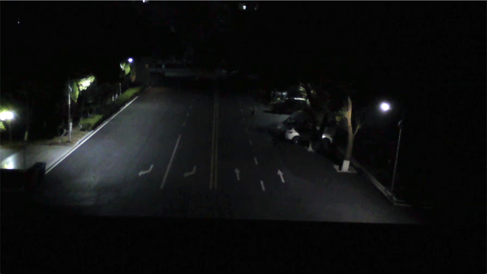
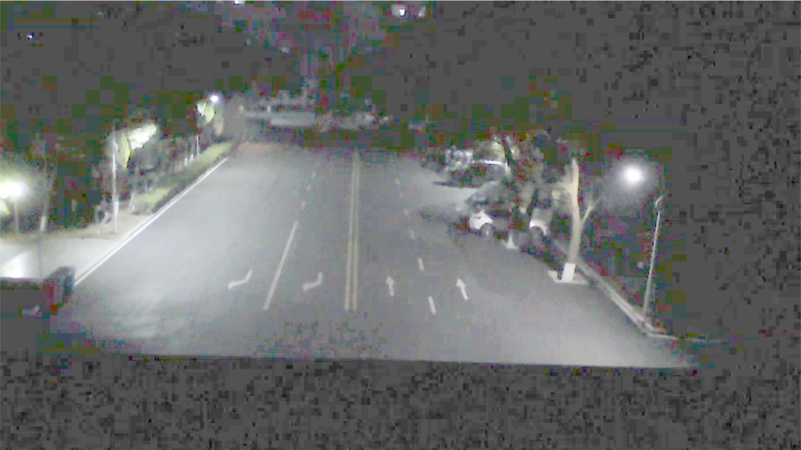
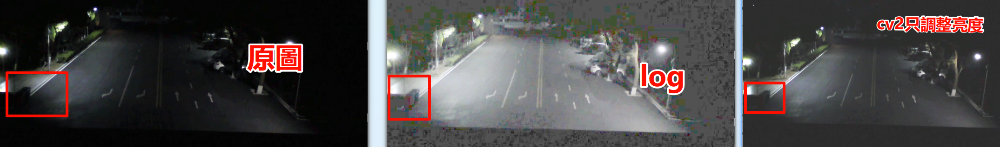
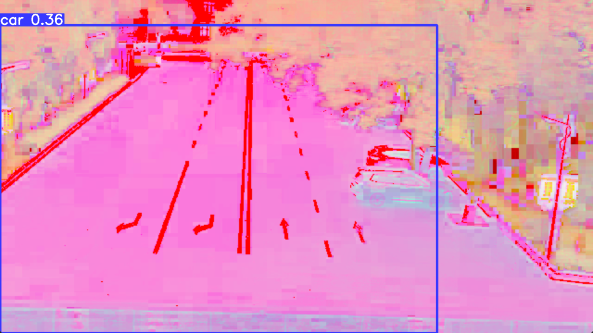
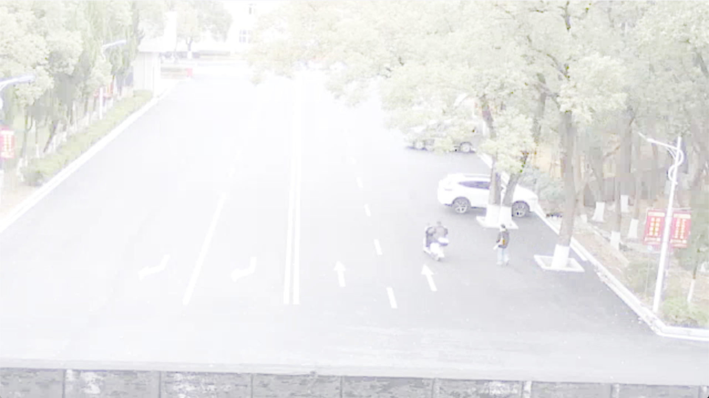
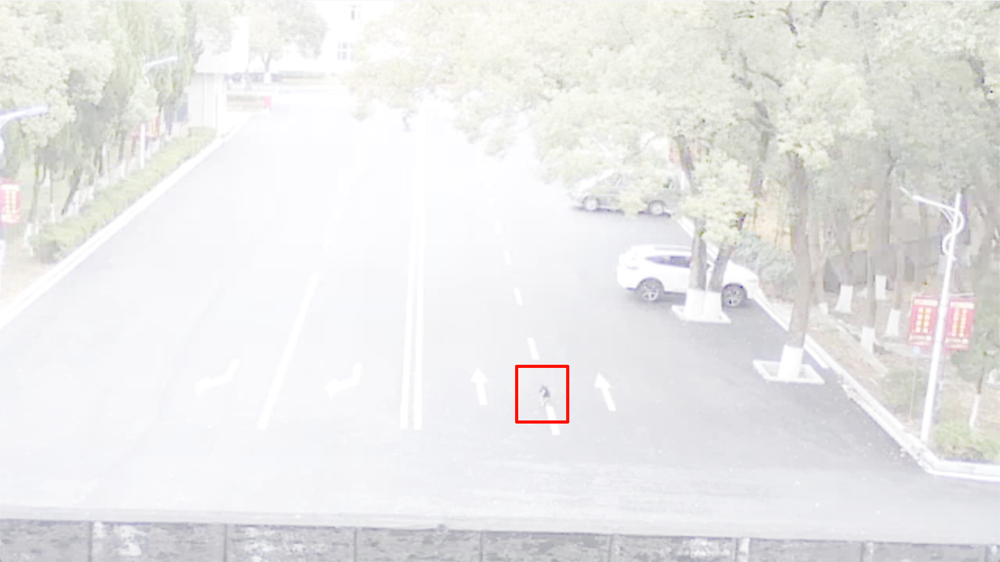
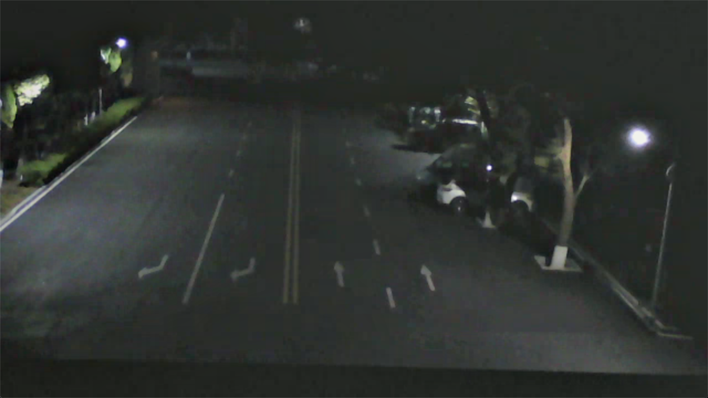
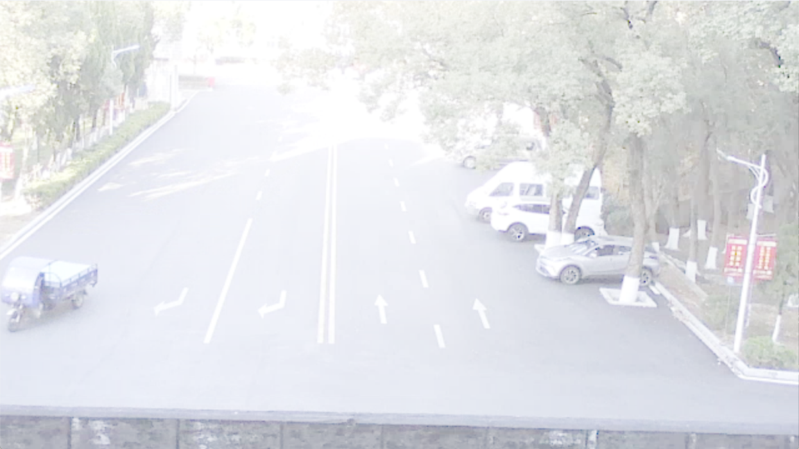
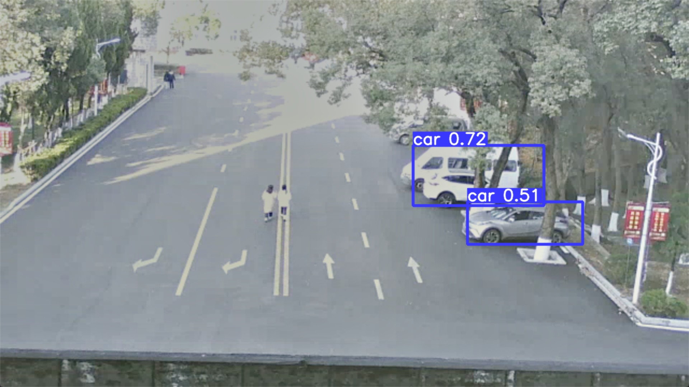

## 論文優化

取對數LOG等級優化

取Log后的數量級

:::taco:這個色彩對於圖像識別而言好像挺重要的如果訓練圖片色彩于實際的色彩間存在很大的區別是否能正常識別

原圖

取對數log后的圖片

三者對比

hlvs由於顔色色塊與訓練色塊有本質區別所以識別存在比較大的問題

取對數log后存在過白色花

rgb由於取log后差異不明顯在實際的應用中存在較大問題

retinex

original

关于总结：（人话）

在上述的实验中发现，对图像取log让图像整趋于稳定，在夜间表现较优，但是在白天明显效果会更差， 表现出全局发白， 整体呈现白色状态， 改用其他颜色方案后发现与模型训练的时候的显示截然不同，导致模型识别的时候识别存在很严重的问题， 出现识别效率差，出现识别幻觉，识别出错，不识别等情况

改用 Retinex 后对整体上有显出的改变并且这种改变是对图像的一种增强，并未改变图像的本质颜色，与训练集所用的图像整体上保持一直，从图中明显能看出车的轮廓在 Retinex 下极大程度恢复了物体原本的光照属性

官言

在实验过程中发现，对输入图像进行对数变换能够有效压缩动态范围，使像素分布趋于稳定，在夜间或低照度场景下表现出较好的增强效果。然而，在白天或高亮度场景中，该变换会导致图像整体亮度显著抬升，出现明显的全局过曝现象，图像呈现出泛白特征，细节对比度明显下降。

进一步实验表明，当采用不同的颜色空间或颜色映射策略进行处理后，增强图像的视觉分布与模型训练阶段所使用的数据分布存在显著差异，导致输入特征发生分布偏移。该偏移在下游视觉感知与识别任务中表现为模型推理性能显著下降，具体表现为识别准确率降低、误检增加、漏检 增多，甚至在部分场景下出现明显的识别幻觉现象。

在引入 Retinex 算法后，图像在整体观感上发生了显著变化，这种变化主要体现在对图像可辨识信息的增强，而非对其本质颜色分布的破坏。处理后的图像在色彩特性上与训练数据所使用的原始图像整体保持一致，有效避免了由颜色偏移引入的分布不匹配问题。与此同时，从视觉效果上可以明显观察到，在 Retinex 处理下，车辆的结构轮廓与细节信息得到了显著增强，其原有的反射属性与光照特征在较大程度上得以恢复，从而提升了目标在复杂光照条件下的可感知性。

