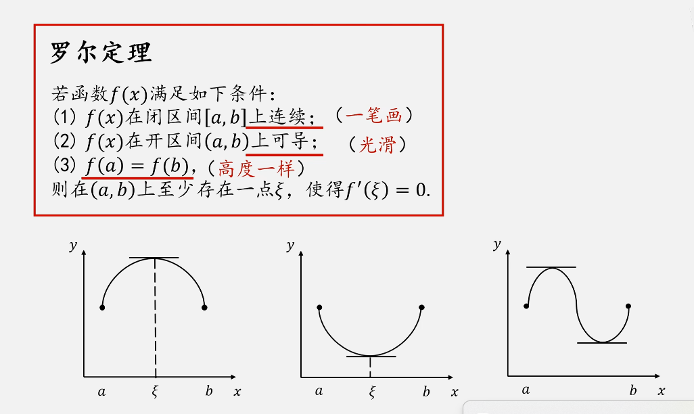
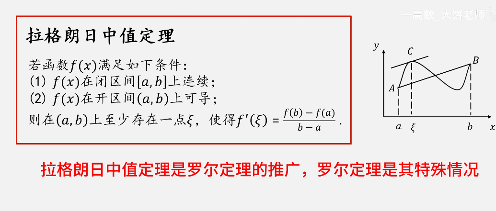
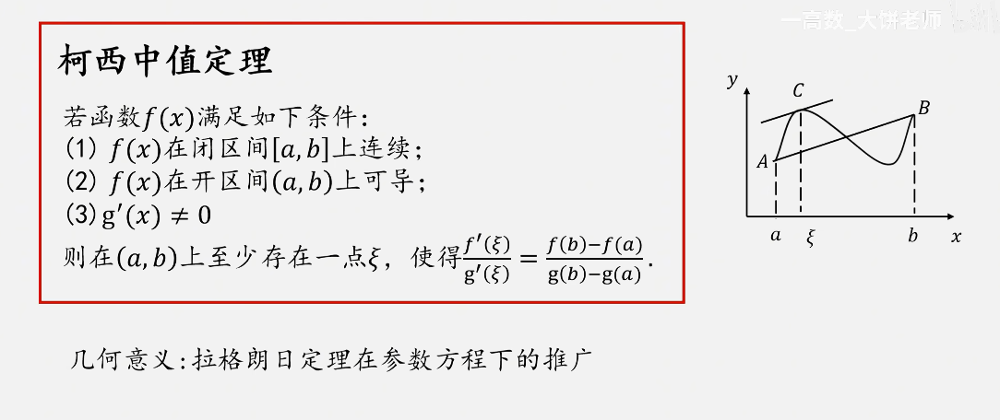

## 导数的应用

## 函数的单调性

① 若在$(a,b)$内$f^\prime(x) > 0$，则$f(x)$在$[a,b]$↗ 

② 若在$(a,b)$内$f^\prime(x) < 0$，则$f(x)$在$[a,b]$​↘  

## 函数的极值

- 极值与极大值和极小值

## 函数的凹凸性

## 中值定理

区间的变化率之间的关系，中值定理一般用于证明题

### 罗尔定理

### 拉格朗日中值定理

### 柯西定理（难）

## 洛必达法则

