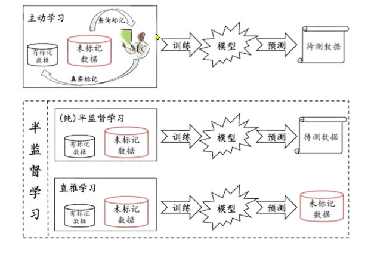

## 有监督，无监督，半监督,强化学习

## 机器学习建模流程

1. 获取数据
2. 数据基本处理
3. 特征工程
4. 机器学习
5. 模型评估

## 有监督学习模型训练和模型预测

## 特征工程概念入门

1. 特征提取
2. 特征预处理: 特征对模型的影响，因量纲问题，有些特征对模型影响大，有些特征影响效 （归一化， 标准化）
3. 特征降维： 将原始数据的维度降低
4. 特征选择： 原始始数据特征很多，但是对模型训练相关是其中一个特征集合子集
5. 特征组合： 把多个的特征合并成一个特征。一般利用乘法或加法来完成

## 拟合

欠拟合， 过拟合， 泛化

泛化： 模型在非训练集上表现好坏的能力

奥卡姆剃刀原则： 给定两个具有相同泛化误差的模型，较简单的模型比较复杂的模型更可取。

## KNN算法简介

K-近邻算法简称KNN， 算法思想为： 如果一个样本在特征空间中的k个最相似的样本中的大多数属于某一个类别，则该样本也属于这个类别

如何确定样本的相似性？

超参

KNN解决的问题有俩种一种是分类一种是回归

## KNN分类与回归流程

分类流程

1.计算未知样本到每一个训练样本的距离
2.将训练样本根据距离大小升序排列
3.取出距离最近的K个训练样本
4.进行多数表决，统计K个样本中哪个类别的样本个数量
5.将未知的样本归属到出现次数最多的类别

回归流程

1.计算未知样本到每一个训练样本的距离
2.将训练样本根据距离大小升序排列
3.取出距离最近的K个训练样本
4.把这个K个样本的目标值计算其平均值
5.将未知的样本预测的值了

## K值的选择

K值过大会发送欠拟合（不容易被异常值影响），过小会发送过拟合

如果K=N

## KNN算法分类API

## KNN算法回归API

## 路径方法

## 特征预处理归一化

 

## 特征预处理标准化

